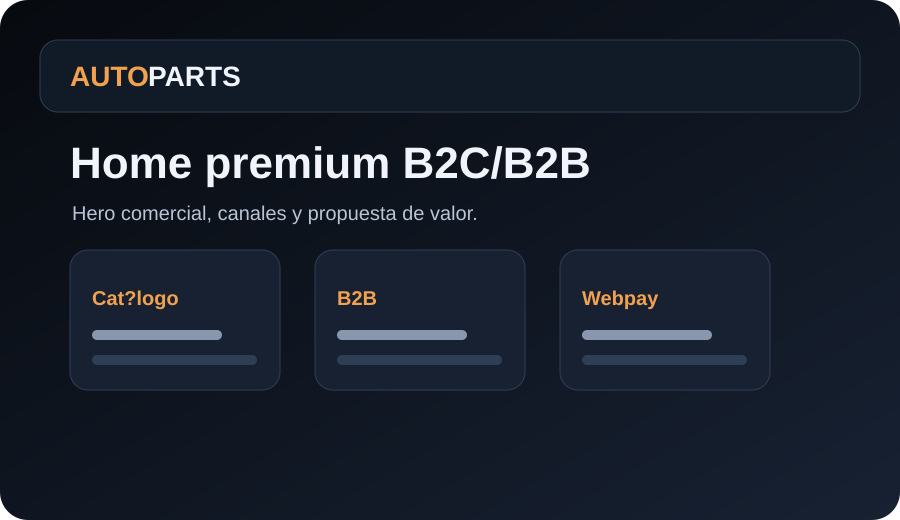
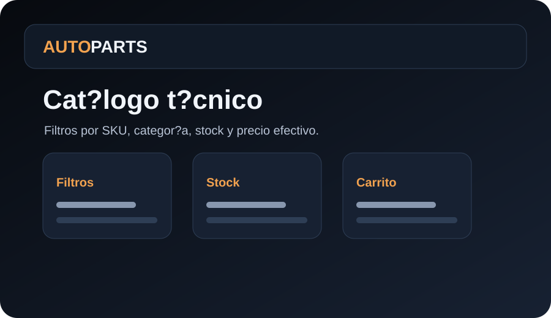
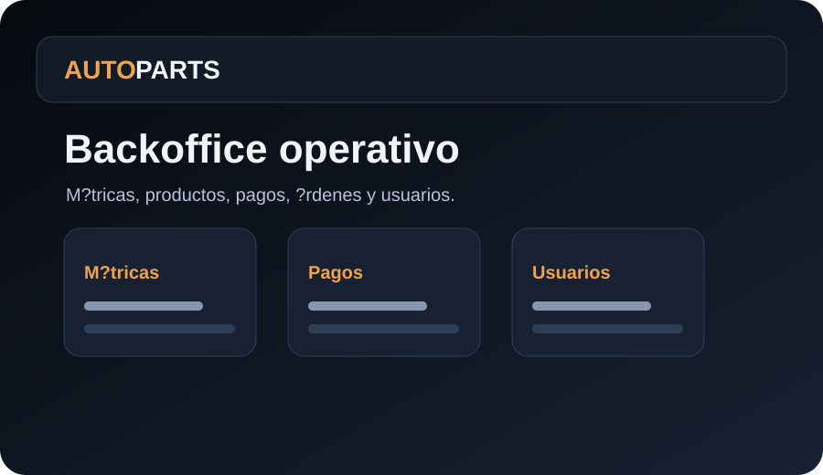

# AutoParts ? E-commerce B2C/B2B con Backoffice y Webpay

AutoParts es un proyecto full-stack de e-commerce automotriz pensado para portfolio profesional: cat?logo B2C, canal mayorista B2B, carrito, ?rdenes, Webpay sandbox, backoffice administrativo, documentaci?n t?cnica y CI. La intenci?n no es mostrar una demo aislada, sino un flujo de producto defendible de punta a punta.

## Qu? demuestra

- Backend Django + DRF con JWT, roles y contratos documentados.
- Flujo de compra completo: cat?logo ? carrito ? orden ? Webpay sandbox ? confirmaci?n.
- Canal B2B protegido con precios efectivos por rol distribuidor/admin.
- Backoffice para productos, categor?as, pagos, ?rdenes, usuarios y m?tricas.
- Docker Compose para levantar PostgreSQL, API y frontend en local.
- Observabilidad b?sica: healthcheck, logs JSON y `X-Request-ID`.

## Stack

| Capa | Tecnolog?a |
| --- | --- |
| Backend | Django, Django REST Framework, Simple JWT, drf-spectacular |
| Frontend | React, React Router, Axios, React Testing Library, Playwright |
| Base de datos | PostgreSQL |
| Infra local | Docker Compose |
| Pagos | Webpay sandbox / integraci?n Transbank |
| Calidad | GitHub Actions, tests backend/frontend, lint, Docker smoke, e2e |

## Arquitectura r?pida

```text
backend/   API REST, auth, dominio ecommerce, Webpay, backoffice y tests
docs/      referencia API, auditor?a, playbook operativo y planes
frontend/  tienda B2C, canal B2B, backoffice React y e2e
.github/   templates y workflow CI
```

## Capturas / demo visual

> Las capturas son placeholders de portfolio generados para documentar el recorrido visual. Reemplazar por screenshots reales cuando se publique una demo p?blica.

| Home | Cat?logo | Backoffice |
| --- | --- | --- |
|  |  |  |

## Inicio r?pido con Docker

1. Copiar variables de ejemplo:

```bash
copy .env.example .env
copy backend\.env.example backend\.env
copy frontend\.env.example frontend\.env
```

2. Revisar secretos locales:

- `DJANGO_SECRET_KEY`: usar un valor propio en local.
- Configurar `WEBPAY_COMMERCE_CODE` y `WEBPAY_API_KEY` con credenciales sandbox/integraci?n propias.
- No usar credenciales demo ni valores de ejemplo en producci?n.

3. Levantar stack:

```bash
docker compose up --build
```

4. URLs principales:

- Frontend: `http://localhost:3000`
- Backend API: `http://localhost:8000/api`
- Healthcheck: `http://localhost:8000/api/health/`
- Swagger UI: `http://localhost:8000/api/docs/swagger/`
- ReDoc: `http://localhost:8000/api/docs/redoc/`

## Usuarios demo locales

El stack Docker ejecuta bootstrap demo por defecto (`BOOTSTRAP_PORTFOLIO=true`). Las credenciales son **solo para entorno local/demo**.

| Rol | Usuario | Password | Uso |
| --- | --- | --- | --- |
| Admin | `admin_portfolio` | `PORTFOLIO_ADMIN_PASSWORD` | Backoffice `/admin-app` |
| Cliente | `cliente_demo` | `PORTFOLIO_CUSTOMER_PASSWORD` | Compra B2C |
| Distribuidor | `dist_demo` | `PORTFOLIO_DISTRIBUTOR_PASSWORD` | Cat?logo B2B |

Para rehidratar datos demo manualmente:

```bash
docker compose exec backend python manage.py bootstrap_portfolio --reset-stock --force-passwords
```

## Flujos clave

- Registro p?blico: solo `customer` y `distributor`.
- Login JWT con claims de `role` y `username`.
- Cat?logo p?blico: `GET /api/products/` con filtros `q`, `search`, `category`.
- Cat?logo B2B: `channel=b2b`, requiere rol `distributor` o `admin`.
- Orden: `POST /api/orders/` prepara el pago sin descontar stock todav?a.
- Webpay: `POST /api/webpay/init/` y `POST /api/webpay/commit/` cierran el flujo.
- Backoffice: m?tricas, productos, categor?as, pagos, ?rdenes y usuarios.

## Calidad y evidencia

Comandos esperados por CI y QA local:

Backend:

```bash
cd backend
python manage.py check
python manage.py test
```

Frontend:

```bash
cd frontend
npm run lint
npm run test:ci
npm run e2e
npm audit --omit=dev --audit-level=moderate
```

> Por regla del repo, no ejecutar build local despu?s de cambios; el build se valida en GitHub Actions.

## Seguridad y tradeoffs

- El proyecto usa JWT en `localStorage` para simplificar la demo local. En producci?n conviene usar cookies `HttpOnly`, rotaci?n de refresh tokens y protecci?n CSRF acorde al despliegue.
- Webpay usa sandbox. `.env.example` usa placeholders; configura tus credenciales de integraci?n localmente.
- Los archivos `.env` reales est?n ignorados por Git.

## Documentaci?n relacionada

- [Referencia API](docs/API.md)
- [Auditor?a de cierre](docs/FINAL_AUDIT.md)
- [Contribuci?n](CONTRIBUTING.md)
- [Playbook de agentes](docs/AGENT_PLAYBOOK.md)
- [Tracker del plan](docs/PLAN_TRACKER.md)
- [Plan visual Fase 4](docs/UIUX_PHASE4_PLAN.md)
